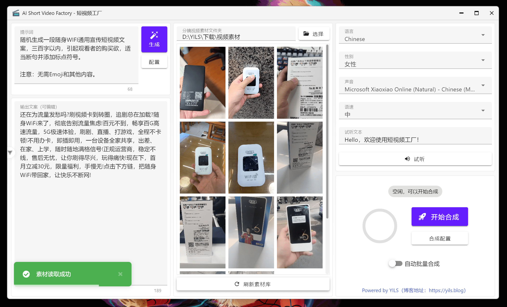

# 软件介绍

## 📖 关于项目

  

**短视频工厂**是一个开源的桌面端应用，旨在通过AI技术简化短视频的制作流程。用户可以通过简单的提示词文本+视频分镜素材，**快速且自动的剪辑出高质量的产品营销和泛内容短视频**。该项目集成了AI驱动的文案生成、语音合成、视频剪辑、字幕特效等功能，旨在为用户提供开箱即用的短视频制作体验。

- 🤖 **AI驱动**：集成了最新的AI技术，提升视频制作效率和质量
- 📝 **文案生成**：基于提示词生成高质量的短视频文案
- 🎥 **自动剪辑**：支持多种视频格式，自动化批量处理视频剪辑任务
- 🎙️ **语音合成**：将生成的文案转换为自然流畅的语音
- 🎬 **字幕特效**：自动添加字幕和特效，提升视频质量
- 📦 **批量处理**：支持批量任务，按预设自动持续合成视频
- 🌐 **多语言支持**：支持中文、英文等多种语言，满足不同用户需求
- 📦 **开箱即用**：无需复杂配置，用户可以快速上手
- 📈 **持续更新**：定期发布新版本，修复bug并添加新功能
- 🔒 **安全可靠**：完全本地本地化运行，确保用户数据安全
- 🎨 **用户友好**：简洁直观的用户界面，易于操作
- 💻 **多平台支持**：支持Windows、macOS和Linux等多个操作系统

## 🎞️ 示例视频

<table>
<thead>
<tr>
<th align="center"><g-emoji class="g-emoji" alias="arrow_forward">▶️</g-emoji> 《产品营销短视频》</th>
<th align="center"><g-emoji class="g-emoji" alias="arrow_forward">▶️</g-emoji> 《暖心治愈系语录》</th>
</tr>
</thead>
<tbody>
<tr>
<td align="center"><video src="https://github.com/user-attachments/assets/165a8f96-861b-4cf3-946c-444b9692cef8" controls></video></td>
<td align="center"><video src="https://github.com/user-attachments/assets/12694618-e0fe-4848-8a7e-98b3f3a7aece" controls></video></td>
</tr>
</tbody>
</table>

注：素材来源于网络，仅用于展示剪辑效果

## 🌟 Github 主页

- 项目地址：[https://github.com/YILS-LIN/short-video-factory](https://github.com/YILS-LIN/short-video-factory)

<!-- MARKDOWN链接和图片 -->
[contributors-shield]: https://img.shields.io/github/contributors/YILS-LIN/short-video-factory.svg?color=c4f042&labelColor=black&style=flat-square
[contributors-url]: https://github.com/YILS-LIN/short-video-factory/graphs/contributors
[forks-shield]: https://img.shields.io/github/forks/YILS-LIN/short-video-factory.svg?color=8ae8ff&labelColor=black&style=flat-square
[forks-url]: https://github.com/YILS-LIN/short-video-factory/network/members
[stars-shield]: https://img.shields.io/github/stars/YILS-LIN/short-video-factory.svg?color=ffcb47&labelColor=black&style=flat-square
[stars-url]: https://github.com/YILS-LIN/short-video-factory/stargazers
[issues-shield]: https://img.shields.io/github/issues/YILS-LIN/short-video-factory.svg?labelColor=black&style=flat-square
[issues-url]: https://github.com/YILS-LIN/short-video-factory/issues
[release-shield]: https://img.shields.io/github/v/release/YILS-LIN/short-video-factory?labelColor=black&style=flat-square
[release-url]: https://github.com/YILS-LIN/short-video-factory/releases
[release-date-shield]: https://img.shields.io/github/release-date/YILS-LIN/short-video-factory?color=9cf&style=flat-round
[license-shield]: https://img.shields.io/github/license/YILS-LIN/short-video-factory.svg?labelColor=black&style=flat-square
[license-url]: https://github.com/YILS-LIN/short-video-factory/blob/main/LICENSE
