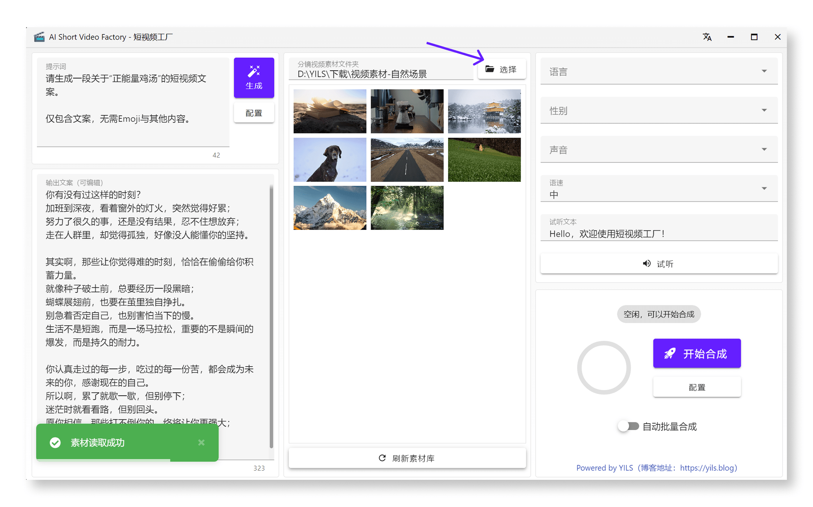

# 导入分镜视频素材

## 前言

在生成短视频之前，你需要先导入分镜视频素材。这些素材可以是你自己拍摄的视频片段，也可以是从素材网站下载的免版权视频。请确保这些视频素材符合你的创作需求，并且质量较高，以便生成更好的短视频效果。

另外有几个建议:

- **视频格式**：建议使用常见的视频格式，如 MP4（目前仅支持 MP4 格式），以确保兼容性。
- **视频比例**：所有建议使用相同的比例，以保证视频观感的一致性。
- **视频时长**：每个视频片段的时长建议在 3 到 15 秒之间，过长的视频可能会影响短视频的观感，目前混剪时最多提取视频的15秒。
- **使用不同的分镜**：不同的分镜可以提供不同的视角，增加短视频的多样性，并且可以拥有更好的生成效果，至于长视频的分镜提取可以使用剪映实现。
  
## 如何导入

点击中间区域顶部的 “选择” 按钮，在弹出窗口中选择你已经准备好的分镜视频素材文件夹，点击弹窗中的 “选择文件夹” 按钮即可自动导入该文件夹中的所有视频。

## 悬停预览

将鼠标悬停在视频素材上，可以预览视频内容，方便你快速找到需要的分镜视频。

## 刷新素材列表

如果你在导入视频素材后，添加了新的分镜视频，可以点击底部的刷新按钮，重新加载素材列表，确保所有视频素材都能显示出来。
