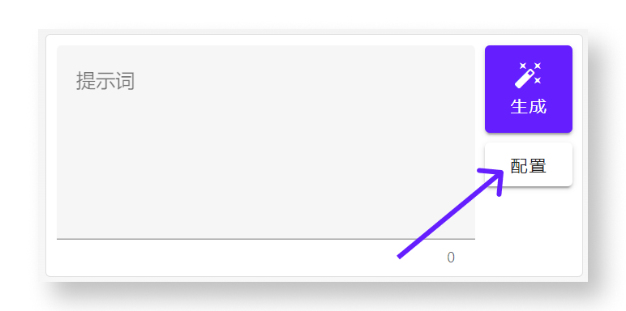
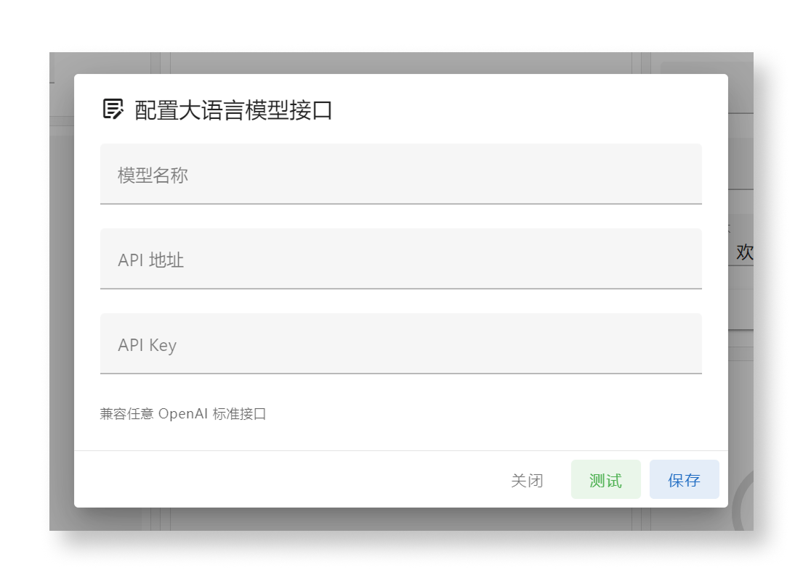
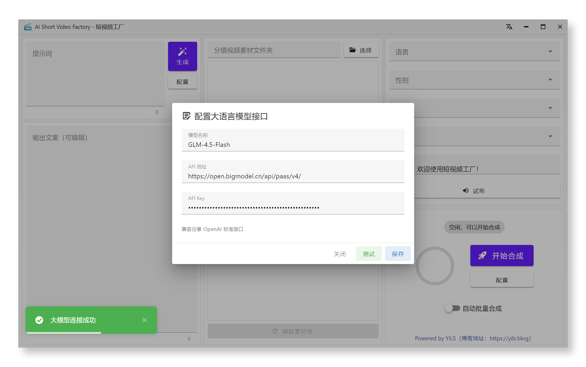

# 配置 LLM 大模型 API

## 前言

在使用本软件生成短视频之前，我们需要先配置 LLM 大语言模型的 API 信息，以便软件可以调用大模型来生成文案内容。

::: tip 提示
如果你还没有 LLM 大模型的 API Key，可以先查看 [申请 LLM API Key - 智谱AI](./llm-apply/bigmodel) 章节，了解如何申请常用的大模型 API Key。
:::

## 了解配置界面

首先，查看左侧分栏中的大模型调用部分，点击 **“配置”** 按钮进入 LLM 大语言模型配置界面。

可以看到，在弹出的配置界面中，我们可以配置 LLM 的 `API 地址`、`密钥`、`使用的模型名称`等信息。

以下三项参数是必须填写的：

- **API 地址**： 大模型服务商提供的 API 接口基础地址（例如：`https://api.openai.com/v1`）。
- **API Key**： 大模型服务商提供的访问密钥。
- **模型名称**： 大模型服务商提供的 LLM 模型名称（不能乱填，此为调用参数传递的模型名称）。

兼容任意支持 **OpenAI 接口规范** 的 LLM 大模型服务商，例如智谱AI、Kimi、OpenAI、Azure、OneAPI、OpenRouter等。

## 填写配置信息

好，接下来，我们以 `智谱AI` 的大模型服务为例，填入相应的配置信息。

> 这里我们使用智谱最新的免费模型。
> 
> 关于这些参数从哪里来的，可以参考 [申请 LLM API Key - 智谱AI](./llm-apply/bigmodel) 章节。

填写完成后，可以点击 **“测试”** 按钮，测试填写的配置信息是否能够正常工作。

如果测试成功，左下角弹出 **“大模型连接成功”** 的提示，就可以点击 **“保存”** 按钮，保存配置信息。

至此，我们就完成了 LLM 大模型 API 的配置。