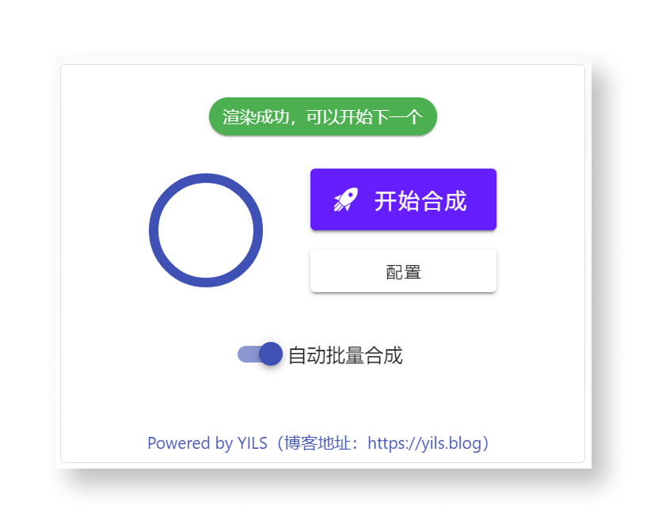

# 批量任务

## 前言

有时候我们需要批量生成多个视频，比如你想要生成一系列的美食视频，或者一系列的旅游视频，甚至是一些教育类的视频内容。手动一个一个生成显然效率太低，这时候就可以使用 **短视频工厂** 的 **批量合成** 功能。

## 开始批量合成

只需勾选 **自动批量合成** 选项即可，软件会在渲染完成一个视频后，自动调用大模型生成下一个文案，开始合成下一个，如此持续不断的生成视频，直到你点击 **停止合成** 按钮为止。

::: tip 提示
至于文件名，软件会自动为其添加一个符合顺序的数字后缀，避免文件名冲突。
:::
