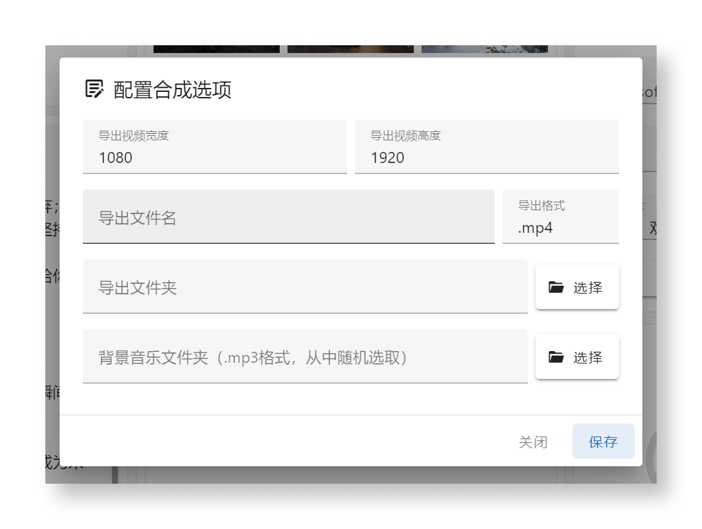
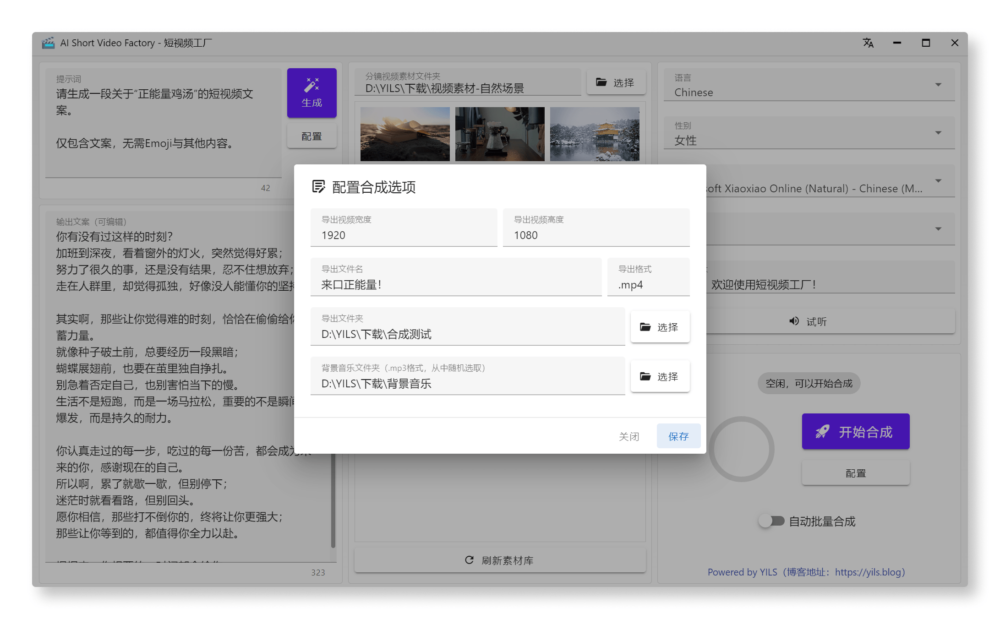
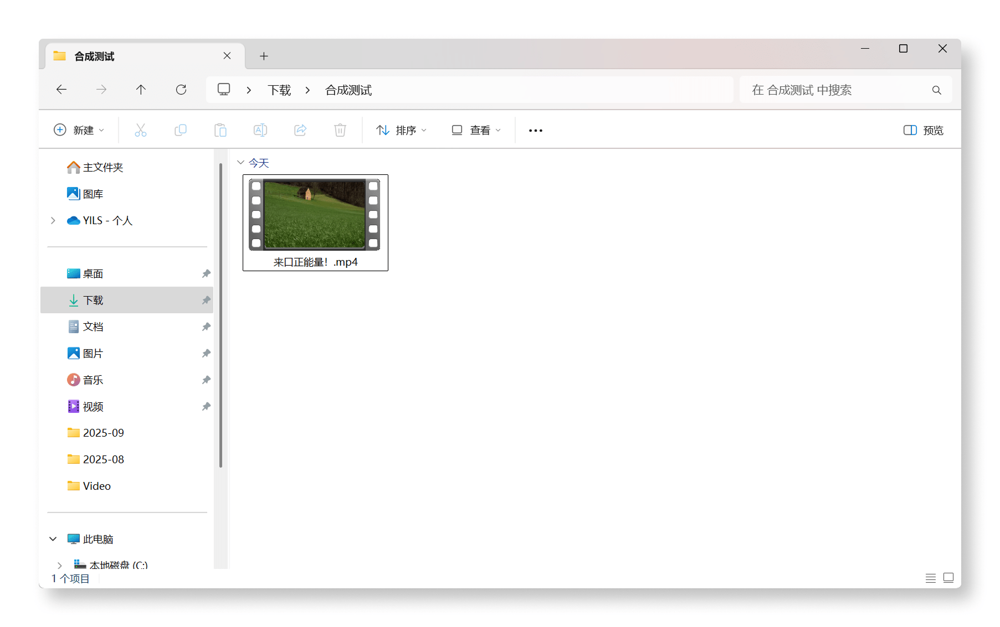

# 一键生成短视频

## 前言

接下来将介绍重中之重，如何使用 **短视频工厂** 的 **一键合成** 功能，快速将 **文本+语音+分镜** 转换为短视频。

## 了解合成配置

在软件主界面的右下角，有一个板块，中间是一个大大的 **开始合成** 按钮，对于第一次使用的用户，我们先点击下方的 **配置** 按钮，进入合成参数配置界面。

在这个界面，我们可以配置合成的参数，包括:

- 合成后的视频分辨率，必填，默认为 **1080x1920** 竖屏1080P。
- 导出文件名，必填
- 导出文件格式，必填，默认为 **mp4** ，暂不可修改。
- 导出文件夹，必填
- 背景音乐文件夹，可以不设置，设置后从中 **随机选择** 一首背景音乐添加到视频中。

未来会增加更多的可调整参数，敬请期待...

## 配置合成参数

由于我导入的分镜视频素材是 1920x1080 的横屏视频，所以我将合成分辨率改为 **1920x1080** 横屏1080P。

::: tip 提示
如需更高清晰度可按需求任意调整，比如需要 4K 分辨率，最好确保你的分镜视频素材也是 4K 的，那么你可以将合成分辨率改为 **3840x2160** （横屏4K）。
:::

::: warning 注意
分辨率的宽高比建议和分镜视频素材保持一致，否则可能会出现黑边或画面被裁剪的情况，如果实在无法确保尺寸一致，软件会尽可能保留素材完整显示。
:::

填写其他参数：

配置好参数后，点击 **保存** 按钮，回到主界面。

## 开始合成

至此，我们已经完成了所有配置工作。

再确认一遍 LLM 提示词、分镜视频素材、TTS语音合成参数无误后。

点击那个大大的 **开始合成** 按钮，软件会自动开始合成视频，并在合成面板中实时显示合成进度，允许随时终止。

::: tip 提示
值得注意的是，如果你的 **输出文案存在**，那么软件会直接使用， 如果你的 **输出文案为空**，软件会自动按照提示词调用大模型生成文案并合成视频。
:::

稍等片刻，合成完成后，打开输出文件夹，即可看到合成后的视频。

