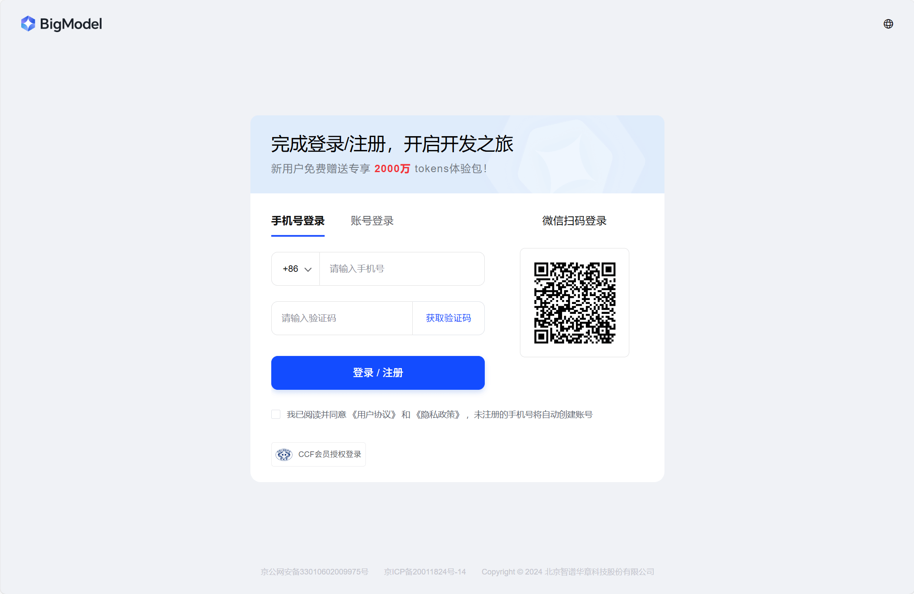
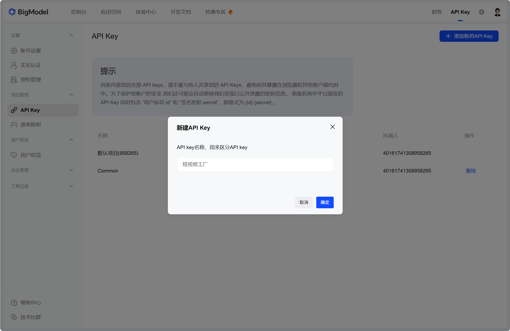
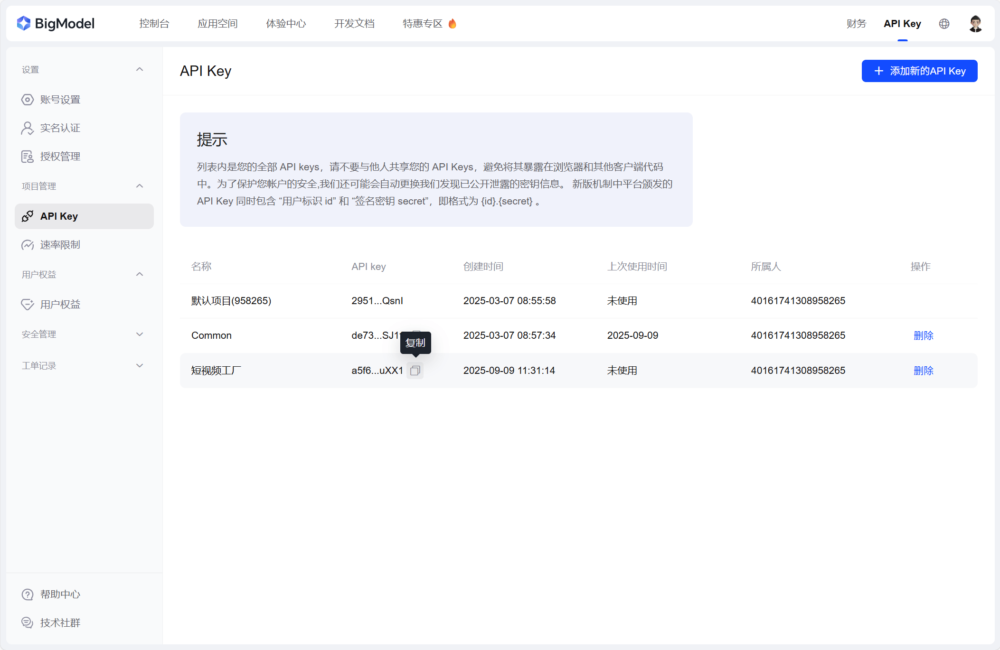

# 智谱 AI 使用教程
 
## 前言

本章节将介绍如何申请并在软件中使用 `智谱 AI` 的大模型接口。

::: tip 提示
目前比较推荐使用智谱 AI，因为它提供了 **完全免费的高级模型** 接口，且兼容 OpenAI 的接口规范，使用起来非常方便。
:::

## 注册智谱开放平台账号

首先，打开 [智谱AI开放平台-登录/注册页面](https://open.bigmodel.cn/login)。

使用手机号+验证码的方式注册一个账号，注册完成后自动登录。

此处不过多赘述，按照页面提示操作即可。



## 获取 API Key

登录后，点击右上角的头像，选择 **“API Key”** 选项，进入 API Key 管理页面。

或者直接点击 [智谱AI开放平台-API Key管理页面](https://open.bigmodel.cn/usercenter/proj-mgmt/apikeys)。

点击 **“添加新的API Key”** 按钮，在弹窗中输入 `短视频工厂` ，点击 **“确定”** 按钮即可创建一个 API Key。



然后点击新创建的 API Key 右侧的 **“复制”** 按钮，将其复制到剪贴板，并粘贴到软件的 LLM 配置界面。



::: tip 提示
软件的 LLM 配置界面请参考 [配置 LLM 大模型 API](../basic/llm-config.md) 章节。
:::

## 获取 API 地址和模型名称

接下来，我们来获取 API 地址和模型名称。

通过 [智谱AI开放平台-文档-OpenAI兼容页面](https://docs.bigmodel.cn/cn/guide/develop/openai/introduction#%E5%88%9B%E5%BB%BA%E5%AE%A2%E6%88%B7%E7%AB%AF) ，我们了解到 智谱 AI 提供兼容 OpenAI 接口规范的 API 基础地址是：

```
https://open.bigmodel.cn/api/paas/v4
```

通过 [智谱AI开放平台-文档-模型概览页面](https://docs.bigmodel.cn/cn/guide/start/model-overview#%E6%96%87%E6%9C%AC%E6%A8%A1%E5%9E%8B) ，我们可以看到 智谱 AI 提供的多个免费大模型名称。

这里我们选择一个合适的模型，例如：

```
GLM-4.5-Flash
```

将上述 API 地址和模型名称填写到软件的 LLM 配置界面中。

::: tip 提示
软件的 LLM 配置界面请参考 [配置 LLM 大模型 API](../basic/llm-config.md) 章节。
:::

至此，我们就完成了基于 `智谱 AI` 的大模型 API 的配置。
