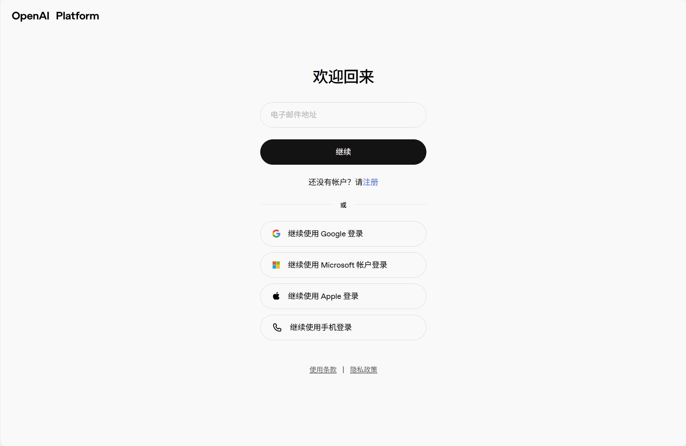
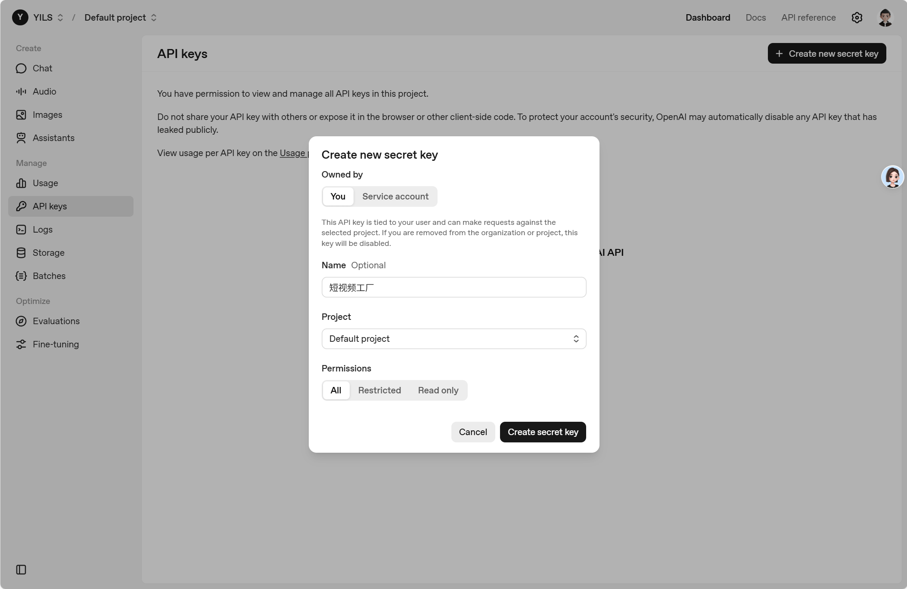
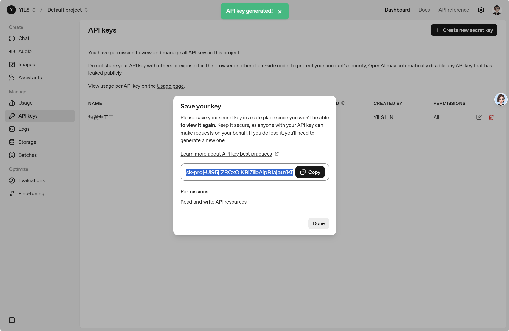

# Open AI 使用教程
 
## 前言

本章节将介绍如何申请并在软件中使用 `Open AI` 的大模型接口。

::: warning 注意
使用 Open AI 需要通畅的网络环境，且 Open AI 的大模型接口是收费的，价格较高，请根据自身需求谨慎申请和使用。
:::

## 注册 Open AI 账号

首先，打开 [OpenAI开放平台-登录/注册页面](https://auth.openai.com/log-in)。

按照页面提示登录或注册一个 Open AI 账号。



## 获取 API Key

登录后，点击顶部的 **“Dashboard”**，再点击左侧的 **“API Keys”**， 进入 API Key 管理页面。

或直接点击 [OpenAI开放平台-API Keys 页面](https://platform.openai.com/api-keys)。

点击右上角的 **“Create new secret key”** 按钮，在弹窗中输入 `短视频工厂` ，点击 **“Create secret key”** 按钮即可创建一个 API Key。



然后点击新创建的 API Key 右侧的 **“Copy”** 按钮，将其复制到剪贴板，并粘贴到软件的 LLM 配置界面。



::: warning 注意
Open AI 的 API Key 只能查看一次，请妥善保存。如果丢失，需要删除后重新创建一个新的 API Key。
:::

::: tip 提示
软件的 LLM 配置界面请参考 [配置 LLM 大模型 API](../basic/llm-config.md) 章节。
:::

## 获取 API 地址和模型名称

接下来，我们来获取 API 地址和模型名称。

OpenAI 提供的 API 基础地址是：

```
https://api.openai.com/v1
```

关于模型名称，可以参考 [OpenAI开放平台-模型价格列表页面](https://platform.openai.com/docs/pricing)  选择一个合适的模型。

例如：

```
gpt-5
```

将上述 API 地址和模型名称填写到软件的 LLM 配置界面中。

::: tip 提示
软件的 LLM 配置界面请参考 [配置 LLM 大模型 API](../basic/llm-config.md) 章节。
:::

另外，可以参照 [OpenAI开放平台-财务管理页面](https://platform.openai.com/settings/organization/billing/overview) 使用信用卡进行账户余额充值。

至此，我们就完成了基于 `Open AI` 的大模型 API 的配置。
